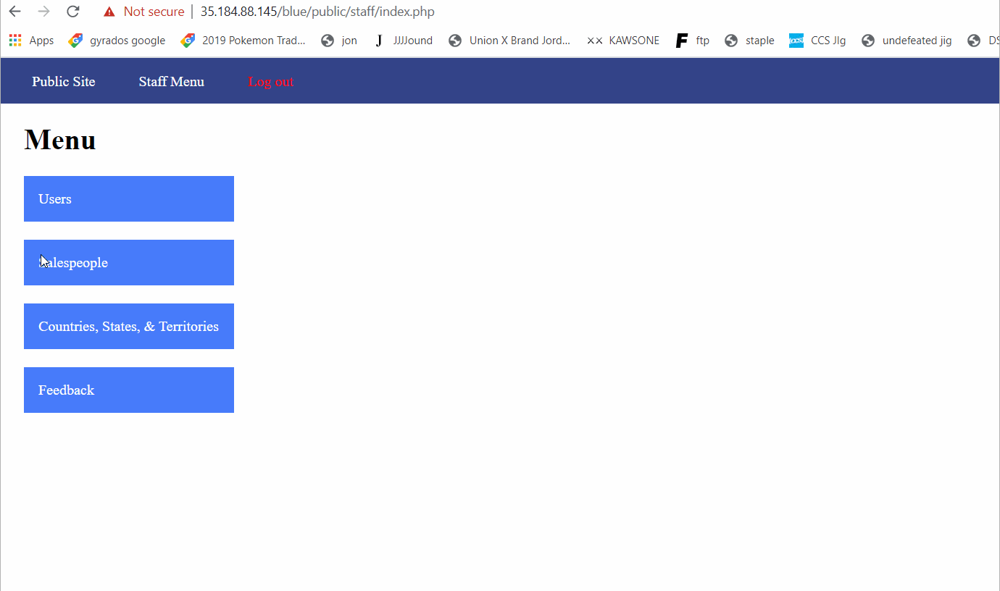
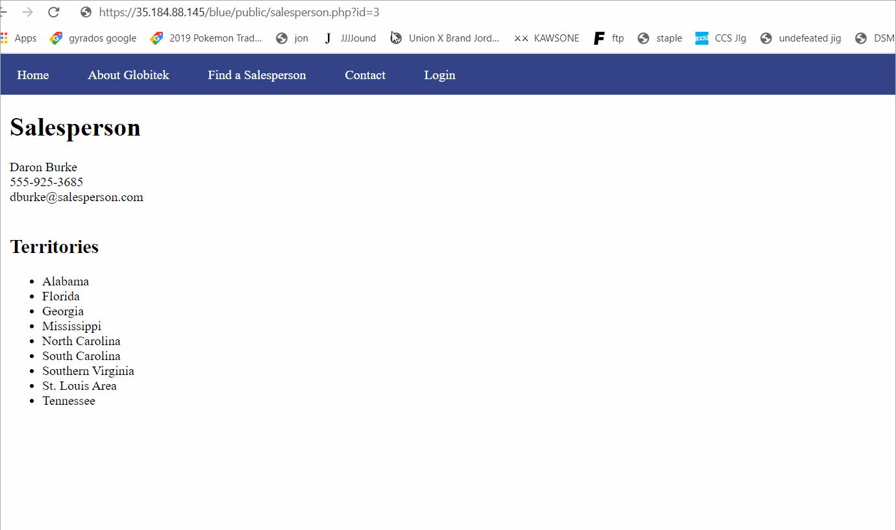
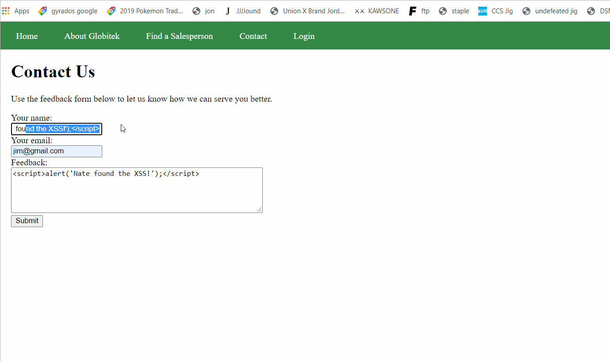
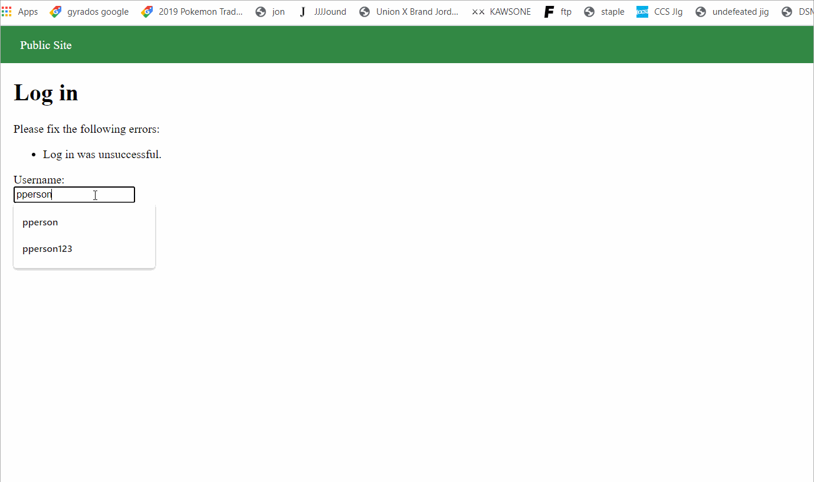
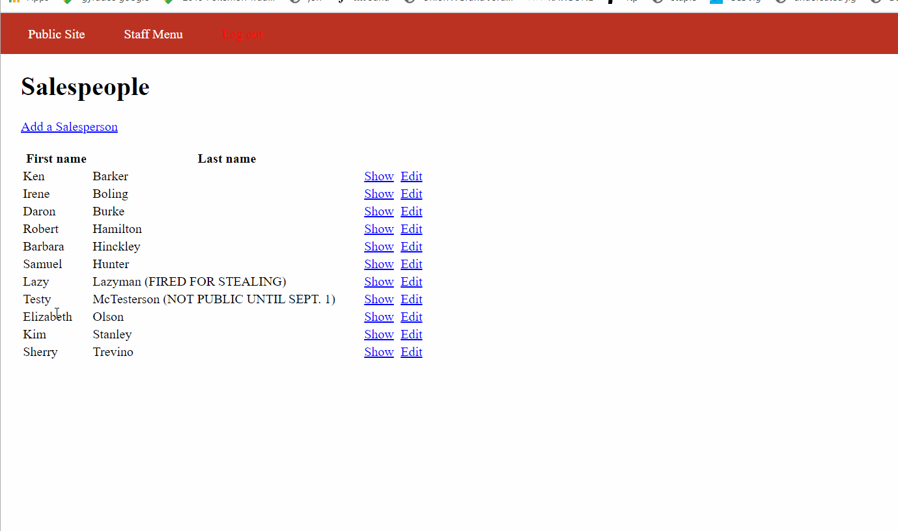

# Project 8 - Pentesting Live Targets

Time spent: 7-8 hours spent in total

> Objective: Identify vulnerabilities in three different versions of the Globitek website: blue, green, and red.

The six possible exploits are:

* Username Enumeration
* Insecure Direct Object Reference (IDOR)
* SQL Injection (SQLi)
* Cross-Site Scripting (XSS)
* Cross-Site Request Forgery (CSRF)
* Session Hijacking/Fixation

Each color is vulnerable to only 2 of the 6 possible exploits. First discover which color has the specific vulnerability, then write a short description of how to exploit it, and finally demonstrate it using screenshots compiled into a GIF.

## Blue

Vulnerability #1: Session Hijacking

Description:
The blue site contained session ids that never expired and didnt care if the user id changed on the site. This allowed me to use burp to get my sessionID logged in as admin on chrome. I then opened up the session changing tool in firefox on a tab that was not logged in. After changing the session ID to that of the logged in tab I was logged in as an admin on the firefox tab.

Vulnerability #2: SQL Injection

Description:  For this vulnerability I had to go to the staff page and add 'OR SLEEP(10)=0; -- to the end of the link. When I clicked enter the site loaded for 10 seconds before coming back. This demonstrated that the site was indeed vulnerable to SQL injections.

## Green

Vulnerability #1: Cross Site Scripting

Description:
The green site did not have any filtering in the "Contact Us" section. This allowed me to put (pointy bracket)script>alert('Natefound the XSS!');</script(pointy bracket) into the name and feedback sections. Then when an admin visited the feedback page the malicious code would excecute.

Vulnerability #2: UserName Enumeration
Description:
The green site had a flaw in the login process that took me a while to realize. When you attempted to login with a username that existed it would repond with bold letters, Log in Unsuccessful. When you tries to sign in with a username that did not exist you were greeted with the same message, but not in bold. This would allow a hackaer to determine if a username is in the system which is bad because you want to give users on your site as little info as possible about how your site works.

## Red

Vulnerability #1: IDOR

Description:
The Red site had a flaw that allowed users to see staff members that were not supposed to be public. You could do this by clicking on a public staff member and changing the id to that of the private employee. The other two websites did not allow you to shange the id in the url preventing this issue from happening.

Vulnerability #2: __________________

Description:

## Notes

Describe any challenges encountered while doing the work
